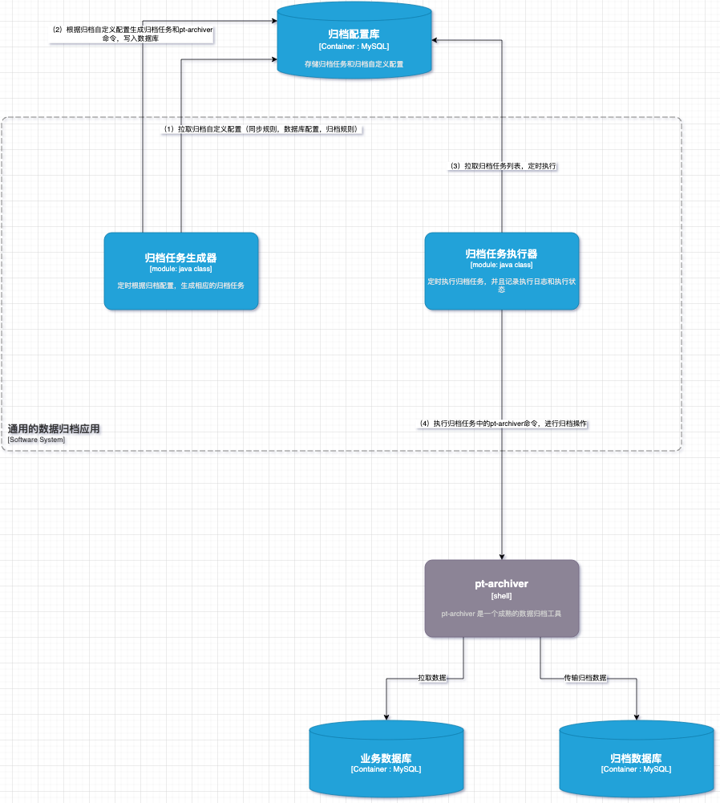

# 工程简介

data-archive-tool 是一个基于pt-archiver之上，封装的通用数据归档工具。

## data-archive-tool能做什么？

- 支持多个不同的数据源进行归档
- 支持分布式事务（pt-archiver 自带）
- 支持DB归档和文件归档和直接删除的归档策略
- 支持自定义定时调度时间
- 仅支持MySQL数据源归档


### data-archive-tool的架构图如下：



- 归档任务生成器：定时根据归档配置，生成相应的归档任务， 根据归档配置和pt-archiver命令模版，动态生成shell命令
- 归档任务执行器：定时执行归档任务，并且记录执行日志和执行状态
- pt-archiver： pt-archiver工具包，用于执行归档操作

# 延伸阅读

### 运行环境：

- JDK8
- linux（CentOS 7）
- pt-archiver
- perl-tool
- MySQL 5.7

### 如何安装data-archive-tool？

#### （1）下载Percona Toolkit:

[Percona-Toolkit-3.4.0.rpm](https://downloads.percona.com/downloads/percona-toolkit/3.4.0/binary/redhat/7/x86_64/percona-toolkit-3.4.0-3.el7.x86_64.rpm)

#### （2）安装前置依赖环境：

```
yum install -y perl-DBI perl-DBD-MySQL perl-Digest-MD5 perl-IO-Socket-SSL perl-TermReadKey
```

#### （3）安装Percona Toolkit:

```
rpm -ivh percona-toolkit-3.4.0-3.el7.x86_64.rpm
```

#### （4）下载源码后使用Maven编译器进行编译：

```
mvn clean package
```

data-archive-tool/target中可以看到可运行的jar

#### （5）初始化data-archive-tool的DB

```
通过MySQL命令运行：data-archive-tool/db/mysql_archiver.sql
```

### 如何启动data-archive-tool?

#### （1）配置data-archive-tool的程序配置application.yml，将它放到/opt/archiver目录下（为了方便演示存放在/opt/archiver，用户可以更改配置存放路径）

```

## 归档规则配置和归档任务的DB地址
spring:
  datasource:
    type: com.zaxxer.hikari.HikariDataSource
    driver-class-name: com.mysql.cj.jdbc.Driver
    url: jdbc:mysql://ip:3306/mysql_archiver?useUnicode=true&characterEncoding=utf-8&useSSL=false&serverTimezone=GMT&allowMultiQueries=true
    username: root
    password: 123qweASD
    max-active: 100

archive:

  ## pt-archiver 程序的安装路径
  pt-archiver-path: /opt/homebrew/bin

  ### 业务数据库和归档数据库都需要创建一个归档账号
  ## 归档账号
  archive-user: root
  ## 归档密码
  archive-pwd: 123qweASD

  ## 归档到DB（会删源数据）模式配置
  archive-config:
    ## 批量每次归档的数据数量
    batch-size: 20000
    ## 指定每个事务的大小（行数）
    txn-size: 1000

  ## 归档到file（会删源数据）模式配置 
  archive-to-file-config:
    ## 归档为文件时，文件的存放路径（注意需要给该路径赋予读写权限）
    archive-file-path: /opt/archive
    ## 批量每次归档的数据数量
    batch-size: 20000
    ## 指定每个事务的大小（行数）
    txn-size: 500

  ## 直接删除模式配置
  delete-config:
    ## 批量每次归档的数据数量
    batch-size: 20000
    ## 指定每个事务的大小（行数）
    txn-size: 1000
    
.... 略去其他的配置    

```

#### （2）启动data-archive-tool

```
nohup java -jar -Dspring.config.location=/opt/archiver/application.yml data-archive-tool-1.0.0.jar > log.file  2>&1 &
```

### 如何使用data-archive-tool?

#### （1）添加归档策略

```
INSERT INTO `mysql_archiver`.`archive_config` (`id`, `source_host`, `source_port`, `source_db`, `source_table`, `dest_host`, `dest_port`, `dest_db`, `dest_table`, `archive_mode`, `charset`, `archive_condition`, `exec_time_window_cron`, `extension_cmd`, `priority`, `sys_ctime`, `sys_utime`, `is_enable`, `remark`) VALUES (7, '192.168.1.xxx', 3306, 'test', 'test_table', '192.168.3.xxx', 3306, 'test_archive', 'test_table_archive', 'ARCHIVE', 'UTF8', 'create_date<DATE_SUB(CURDATE(), INTERVAL 3 MONTH)', '0 0 2 1 * ? *', '', 1, '2022-05-25 07:15:31', '2022-08-26 15:11:03', 1, NULL);
```


|  字段名称| 字段描述  |
|---|---|
|source_host | 源服务器
|source_port | 源服务器端口
|source_db   | 源数据库schema
|source_table| 源数据库表
|dest_host   | 目标服务器
|dest_port   | 目标服务器端口
|dest_db     | 目标数据库schema
|dest_table  | 目标数据库表
|archive_mode| 归档模式：ARCHIVE（归档）,DELETE(只删除不归档)，ARCHIVE_TO_FILE(归档到文件)
|priority    | 优化级，数值越高，在执行时间窗口的有多个任务时，优先执行
|charset     | 字符集，默认：UTF8
|archive_condition |归档条件
|exec_time_window_cron | 执行时间窗口，如：0 0 2 1 * ? *,表示在每月的1日的凌晨2点执行任务
|extension_cmd | 归档扩展命令，可以自己加上特殊的pt-archiver命令
|..... | 略去其他不相关字段

#### （2）触发归档任务生成器，生成归档任务

- 方式一：归档任务生成器会根据exec_time_window_cron的cron表达式自动生成
- 方式二：通过API手动触发生成
```
curl http://ip:8080/api/archiveTasks/generate
```

#### （3）执行归档任务
- 方式一：归档任务执行器，会定时自动执行（大约每5分钟检查一次任务列表）
- 方式二：通过API手动触发执行
```
curl http://ip:8080/api/archiveTasks/execute
```


